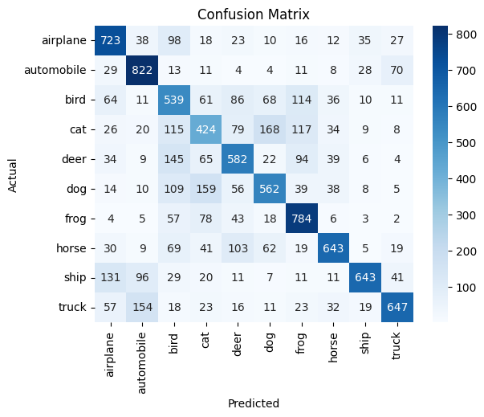
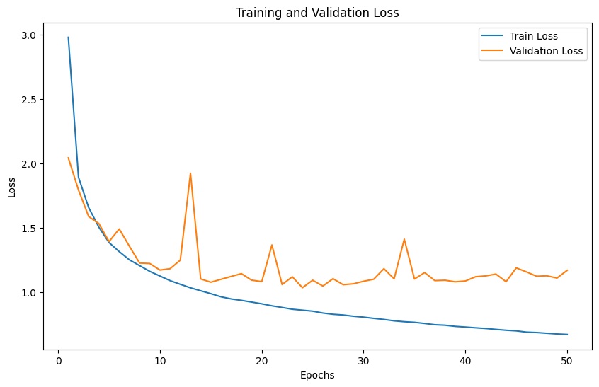
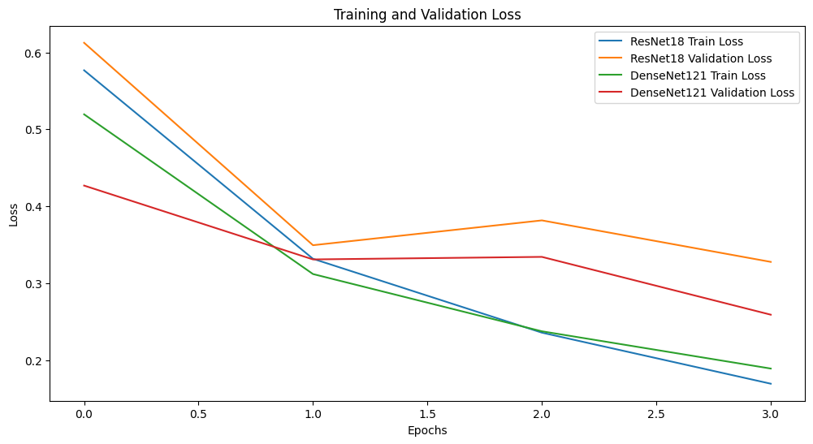
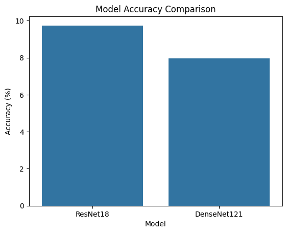
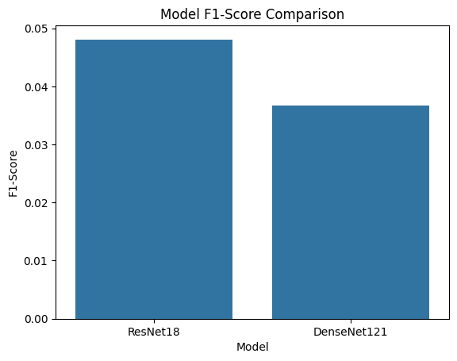

# **Neural Network Project - CIFAR-10 Classification**

This repository contains the implementation of a convolutional neural network (CNN) for image classification using the CIFAR-10 dataset. The project involves model design, training, evaluation, and experimentation with various hyperparameters, including kernel sizes, dropout, batch normalization, and learning rate scheduling.

---

## **Project Description**
This project is part of the Deep Learning and Neural Computation course and focuses on the classification of images in the CIFAR-10 dataset using a convolutional neural network (CNN). The project is divided into two main sections:

1. **Feature Extraction & Classification**:
   - Design and train a CNN model with multiple convolutional layers, pooling layers, and fully connected layers for classification.
   - Experiment with different kernel sizes, pooling layers, and network depths.
   
2. **Transfer Learning with Pretrained Models**:
   - Utilize pretrained models (e.g., ResNet, DenseNet) for CIFAR-10 classification.
   - Compare the performance of these models with the custom-designed CNN.

---

## **Dataset: CIFAR-10**
The CIFAR-10 dataset consists of:
- **60,000** color images of **32x32 pixels**.
- **10 Classes**: airplane, automobile, bird, cat, deer, dog, frog, horse, ship, truck.
- **Train-Test Split**: 50,000 images for training, 10,000 for testing.

The dataset is automatically downloaded using `torchvision.datasets.CIFAR10`.


---

## **Implementation Details**
### **1️⃣ CNN Model Architecture**
The designed CNN model consists of:
- **Feature Extraction**:
  - Multiple **Convolutional Layers** with different kernel sizes.
  - **Pooling Layers** for dimensionality reduction.
  - **Activation Functions** (ReLU) for non-linearity.
  
- **Classification Layer**:
  - Fully Connected (FC) layers.
  - Softmax activation for final class prediction.

---

### **2️⃣ Experimentation & Analysis**
The project includes various experiments to analyze the performance of CNNs on CIFAR-10:

#### **📌 Experiment 1: Impact of Kernel Size**
- Test different kernel sizes in convolutional layers.
- Evaluate how kernel size affects feature extraction, model performance, and computational cost.
- **Key Questions:**
  - How does kernel size influence accuracy?
  - What is the effect on memory and computation time?
  - How does it impact the extracted features?

#### **📌 Experiment 2: Regularization Techniques**
- Implement **Dropout** and **Batch Normalization** to prevent overfitting.
- Compare performance with and without regularization.
- **Key Questions:**
  - Does dropout improve model generalization?
  - How does batch normalization impact convergence speed?

#### **📌 Experiment 3: Effect of Batch Size**
- Experiment with different batch sizes (e.g., 16, 32, 64).
- Compare training stability and model accuracy.
- **Key Questions:**
  - How does batch size influence model performance?
  - Does increasing batch size lead to faster convergence?

#### **📌 Experiment 4: Learning Rate Analysis**
- Train models using different learning rates (e.g., 0.001, 0.01, 0.0001).
- Implement **learning rate schedulers** (MultiStepLR, ReduceLROnPlateau).
- **Key Questions:**
  - How does learning rate affect convergence?
  - Which learning rate scheduler gives the best performance?

#### **📌 Experiment 5: Transfer Learning with Pretrained Models**
- Utilize **ResNet** and **DenseNet** for CIFAR-10 classification.
- Fine-tune pretrained models and compare them with the custom CNN.
- **Key Questions:**
  - Do pretrained models outperform custom CNNs?
  - How does fine-tuning affect accuracy?

---

## **Results & Visualization**
Here are some key results from the experiments:








---

## **Installation & Running the Code**
### **1️⃣ Install Dependencies**
Install the required Python libraries using:
```bash
pip install torch torchvision matplotlib
```

### **2️⃣ Run the Jupyter Notebook**
```bash
jupyter notebook HW04_NN_Mohammad_Javad_Najafi_403131026.ipynb
```

---

## **Key Findings**
- **Best Kernel Size:** **3x3** and **5x5** performed well for feature extraction.
- **Dropout Improves Generalization:** Applying **dropout (0.3-0.5)** reduced overfitting.
- **Batch Normalization Accelerates Training:** Improved convergence and stability.
- **Optimal Batch Size:** **32 or 64** provided the best balance between speed and accuracy.
- **Learning Rate Matters:** **0.001 with ReduceLROnPlateau scheduler** gave the best results.
- **Pretrained Models Performed Better:** **ResNet and DenseNet** outperformed custom CNNs.

---

## **License**
This project is for educational purposes only.

---

### **📌 Notes**
- If you want to contribute or modify the project, feel free to fork the repository.
- If you encounter issues, please report them.

